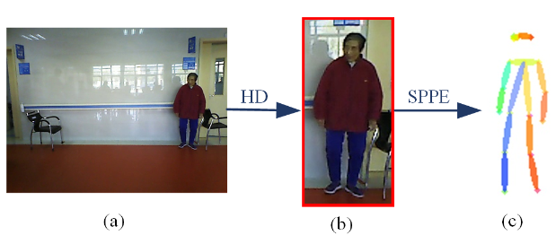
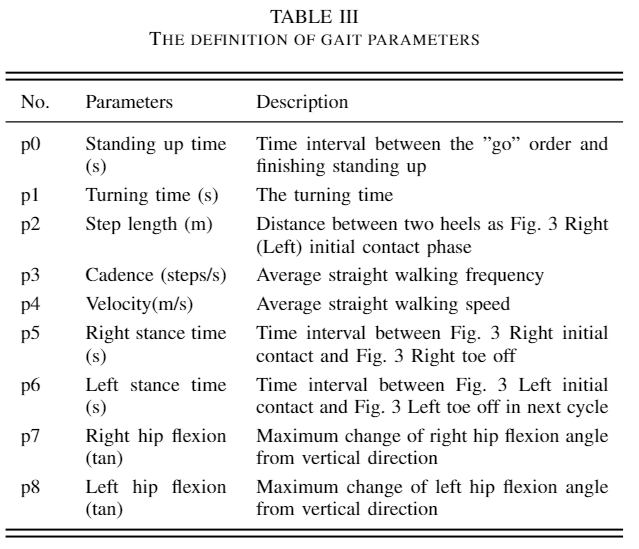
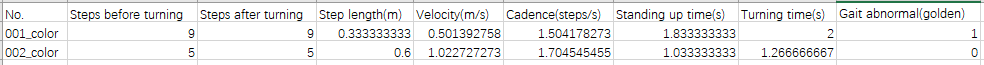

# SAIL-TUG

## Overview
Timed-Up and Go video for SAIL(SAIL-TUG) is a new medical gait data set, focus on abnormal gait detection of person. Following are the detailed descriptions.

* Volume  
The dataset contains 404 TUG videos. By downsampling, 38,098 images is annotated with 2D human poses with 16 pixel-wise key points.  
* Diversity  
The 404 TUG videos are recored in several different places including hospitals, communities and nursing homes. And the gait of the subjects also varied widely.

## Downloads
Please contact the author for the original data.

## Example
* Video example  
  

* Image example  

  

* Annotation points

  Annotation format:

  ```
  {
      "info": {'year': 2019,
               'version': 0.1,
               'description': None,
               'contributor': 'Yanhong Wang',
               'url': None,
               'date_created': '2019-05-29'},
      "licenses": {'url': 'http://creativecommons.org/licenses/by-nc-sa/2.0/',
    'name': 'Attribution-NonCommercial-ShareAlike License'},
      "imgname": [],  #imgname.shape:(30077, 16)
      "bndbox": [],  #bndbox.shape:(30077, 1, 4)
      "part": []   #parts.shape:(30077, 17, 2)
  }
  ```

  Key points visualization example:

  

  Key points list:

  | No.        | 0      | 1      | 2      | 3      | 4    | 5         | 6         |
  | ---------- | ------ | ------ | ------ | ------ | ---- | --------- | --------- |
  | Key points | Nose   | LEye   | REye   | LEar   | REar | LShoulder | RShoulder |
  | No.        | 7      | 8      | 9      | 10     | 11   | 12        | 13        |
  | Key points | LElbow | RElbow | LWrist | RWrist | LHip | RHip      | LKnee     |
  | No.        | 14     | 15     | 16     |        |      |           |           |
  | Key points | RKnee  | LAnkle | RAnkle |        |      |           |           |

  **Note**: $LEye$ means left eye and the same for other joints.

* Gait parameters annotation:

  These are video-level annotations which means every each video corresponds a set of parameters. And there are 404 sets in this dataset.

  

  Two sets of annotation example:

  

  **Note**: The parameters in Table III are not completely manually tagged because of resource factors, which has little inference to the experiments.

## Citation

```
{
@article{SAIL...,
author       = {Yanhong Wang},
title        = {SAIL: A Smart AI Algorithm Framework For Automatic Gait Assessment Based On TUG Test},
month        = ,
year         = ,
doi          = {},
version      = {1.0},
url          = {}
}
```

Please also [email](yhwang18@fudan.edu.cn) us with the title of your paper or work on the dataset.
